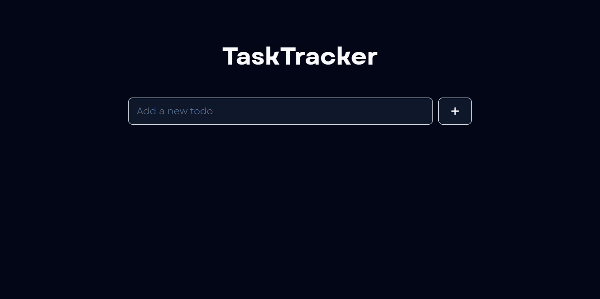
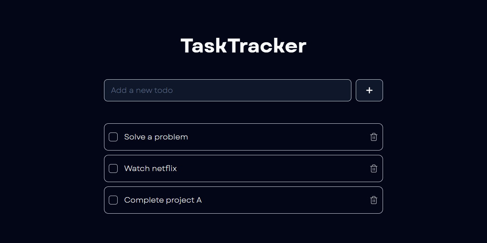

# TaskTracker

A simple and efficient Todo App built with Next.js, Tailwind CSS, Shadcn UI, and Headless UI.

## Demo

[Click here for live preview](https://ipuppyyt.github.io/task-tracker)

## Features

- Add, edit, and delete tasks
- Mark tasks as complete
- Responsive design for desktop and mobile
- Persistent storage using IndexedDB

## Technologies Used

- Next.js: A React framework for building server-rendered applications
- Tailwind CSS: A utility-first CSS framework for rapidly building custom designs
- Shadcn UI: A set of accessible and customizable React components
- Headless UI: A set of unstyled, fully accessible UI components
- IndexedDB: A client-side database for storing data persistently

## Preview

##### Preview 1

##### Preview 2


## Getting Started

### Prerequisites

- Node.js (version 12 or higher)
- npm or yarn

### Installation

1. Clone the repository:

```bash
git clone https://github.com/ipuppyyt/task-tracker.git
```

2. Navigate to the project directory:

```bash
cd task-tracker
```

3. Install dependencies:
```bash
npm install
```
OR
```bash
yarn install
```

### Running the App
1. Start the development server:
```bash
npm run dev
```
OR
```bash
yarn dev
```

2. Open your browser and visit http://localhost:5173 to see the app in action.

## Contributing
Contributions are welcome! If you find any issues or have suggestions for improvements, please feel free to open an [issue](https://github.com/ipuppyyt/task-tracker/issues) or submit a [pull request](https://github.com/ipuppyyt/task-tracker/pulls).